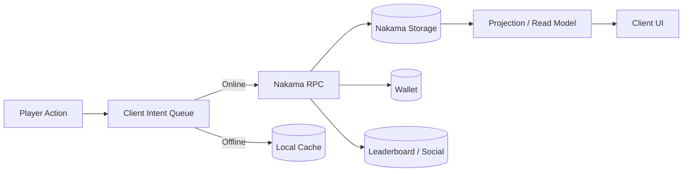
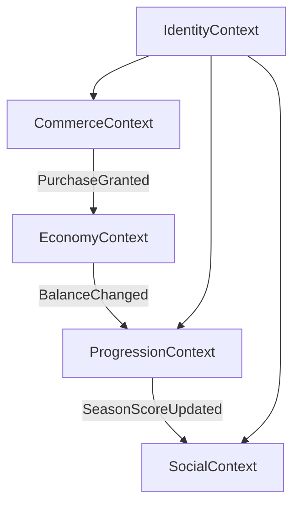
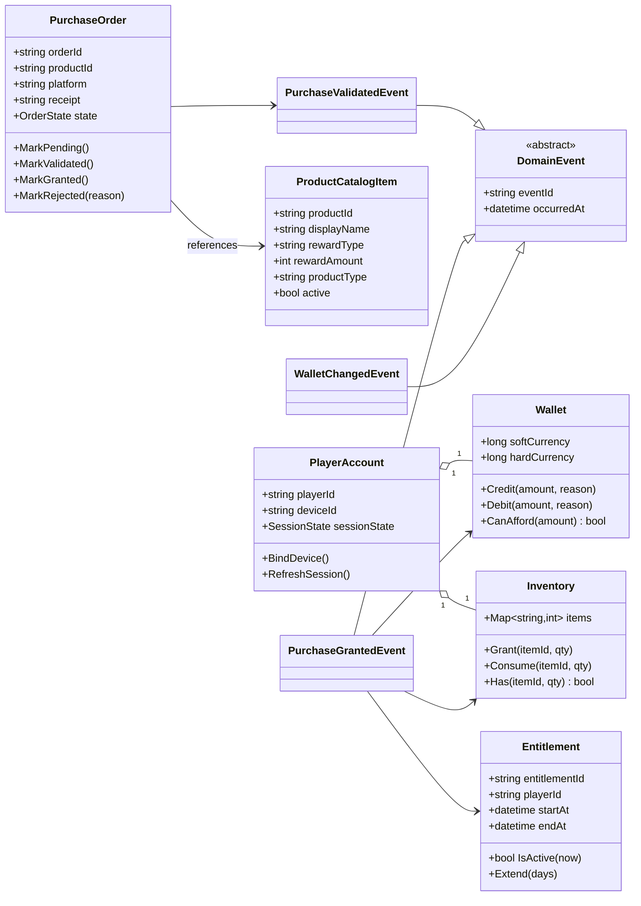
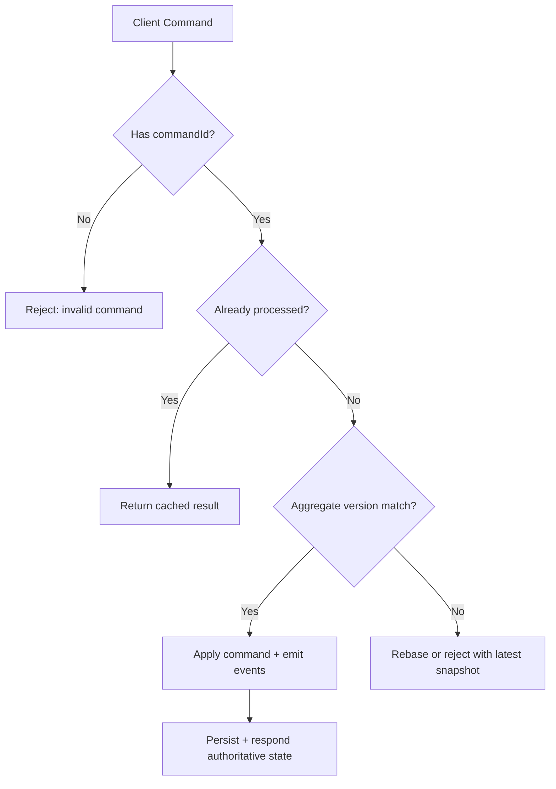
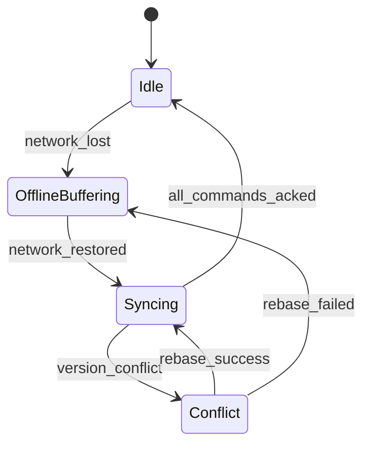
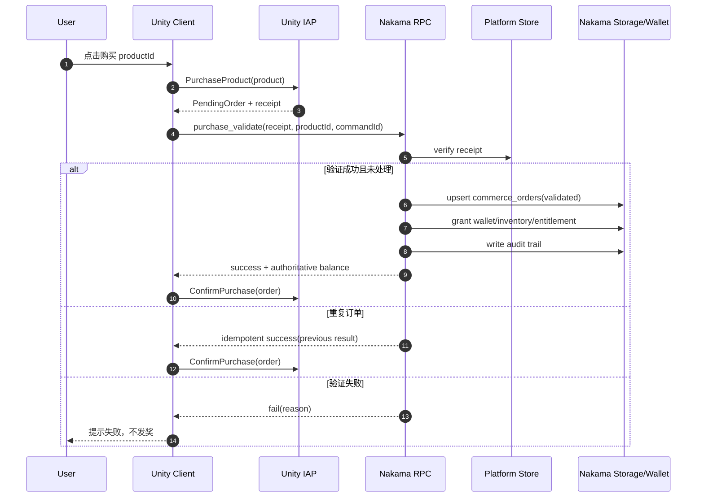
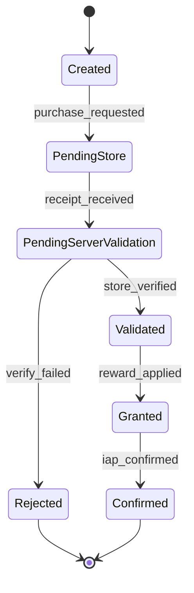
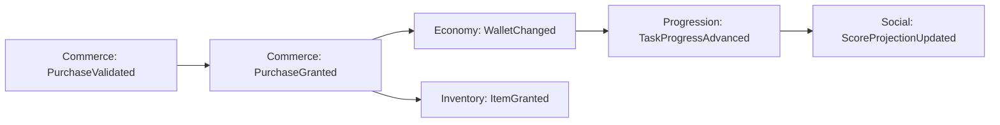

# 基于 DDD 的弱联网游戏存储与 Nakama IAP 游戏化云存储方案（专题）

> 目标：在弱联网环境下，把“可玩性优先”的客户端体验与“服务端可信结算”的云存储体系结合起来，并用 DDD（领域驱动设计）拆分复杂性。

## 1. 问题定义与设计目标

弱联网（高延迟、抖动、短时离线）下，游戏后端设计的核心矛盾是：

- 玩家希望“操作立刻生效”（本地即时反馈）；
- 商业系统要求“结算绝对可信”（尤其 IAP 与经济）；
- 多领域并存（成长、背包、任务、社交、商城）导致模型耦合和演进困难。

本方案将系统分为多个有边界的领域上下文，以 Nakama 作为云端编排与存储中枢：

- 客户端负责体验与离线意图缓存；
- Nakama Authoritative 逻辑负责验证、幂等、发奖与冲突仲裁；
- 按领域进行聚合建模，跨领域通过领域事件协作。



---

## 2. DDD 视角下的限界上下文划分

### 2.1 推荐上下文

1. **IdentityContext（身份域）**
   - 玩家账号、设备、会话、风控标签。
2. **ProgressionContext（成长域）**
   - 关卡、经验、成就、任务进度。
3. **EconomyContext（经济域）**
   - 软硬货币、库存、汇率、消费规则。
4. **CommerceContext（交易域）**
   - 商品目录、IAP 订单、权益（Entitlement）、恢复购买。
5. **SocialContext（社交域）**
   - 排行榜、好友、联盟、赛季关系。

### 2.2 上下文关系图（Context Map）



> 关键原则：
> - 交易域（Commerce）不直接改 UI，只发布“已验证事件”；
> - 经济域（Economy）是货币与库存变更唯一入口；
> - 跨域通过事件，不共享内部实体。

---

## 3. 领域模型（UML 类图）

### 3.1 核心聚合与实体



---

## 4. 弱联网存储策略

### 4.1 写路径：意图优先（Intent-first）

- 客户端不直接提交“最终状态”，只提交“用户意图/命令”；
- 每个命令携带 `commandId`（全局唯一）用于幂等；
- 服务端根据当前聚合版本执行并返回 authoritative 结果。

### 4.2 读路径：投影优先（Projection-first）

- 客户端展示采用“本地快照 + 服务器增量回放”；
- 允许短时间最终一致，关键货币始终以服务端回执为准。

### 4.3 冲突处理策略



### 4.4 离线回放状态机



---

## 5. Nakama 存储建模建议（按领域）

| Bounded Context | Nakama Collection | Key 设计 | 写入模式 | 一致性建议 |
|---|---|---|---|---|
| Identity | `identity_profile` | `playerId` | 覆盖写 | 低冲突，可 LWW |
| Progression | `progression_state` | `playerId:season` | 版本化写 | 乐观锁 + 重试 |
| Economy | `economy_wallet` | `playerId` | 仅服务端写 | 强校验、审计日志 |
| Economy | `economy_inventory` | `playerId` | 增量写 | 命令幂等 |
| Commerce | `commerce_orders` | `platform:transactionId` | append/update | 唯一索引语义 |
| Commerce | `commerce_entitlement` | `playerId:entitlementId` | upsert | 到期任务扫描 |
| Social | `social_projection` | `playerId` | 异步投影 | 最终一致即可 |

> 提示：`commerce_orders` 的 key 应优先使用平台交易唯一标识，天然实现跨重试幂等。

---

## 6. IAP 游戏化云存储：端到端时序

### 6.1 购买验证与发奖（核心闭环）



### 6.2 订单状态机



---

## 7. 领域事件驱动的跨域协作

### 7.1 事件流



### 7.2 事件设计约束

- 事件必须不可变，携带 `eventId`、`aggregateId`、`version`、`occurredAt`；
- 消费者必须幂等（按 `eventId` 去重）；
- 读模型可丢弃旧版本事件（version check）；
- 关键账务事件需要可追溯审计。

---

## 8. 与当前项目的落地映射建议

结合你当前仓库中已完成的组件（`IAPManager.cs`、`ProductCatalog.cs`、`product_catalog.lua`），推荐如下映射：

1. **`product_catalog.lua`**
   - 作为 CommerceContext 的 `ProductCatalog` + `PurchaseValidationService`。
   - 保持 `CATALOG` 为单一真相源（商品奖励定义）。
2. **`IAPManager.cs`**
   - 继续作为客户端 Anti-Corruption Layer：
     - 适配 Unity IAP 事件模型；
     - 把 receipt + productId + commandId 发给 Nakama。
3. **`ProductCatalog.cs`**
   - 作为读模型组装层：
     - 服务端商品元数据（奖励定义）
     - 平台商品动态信息（本地价格、币种、可售状态）
4. **新增建议**
   - `CommandOutbox`（客户端离线命令队列，持久化 commandId）
   - `EconomyProjection`（统一前端显示钱包+库存快照）
   - `PurchaseAudit`（服务端审计日志 collection）

---

## 9. 弱联网下的工程守则（可直接执行）

### 9.1 命令契约（建议）

```json
{
  "commandId": "uuid",
  "commandType": "purchase_validate",
  "playerId": "<playerId>",
  "aggregateId": "platform:transactionId",
  "expectedVersion": 12,
  "payload": {
    "productId": "com.game.coins_100",
    "platform": "apple",
    "receipt": "..."
  },
  "clientTime": "2026-02-27T10:15:30Z"
}
```

### 9.2 成功标准（Definition of Done）

- 同一 receipt 重试 N 次仅发奖一次；
- 离线缓存命令在网络恢复后可回放；
- 钱包、库存、权益在服务端保持可审计；
- 客户端价格展示与服务端奖励定义可独立演进；
- 任何跨域更新都可追踪到来源事件。

---

## 10. 典型反模式与规避

1. **客户端直接发“余额最终值”**
   - 风险：可篡改，且冲突不可追踪。
   - 改进：只发命令，服务端计算结果。
2. **IAP 验证成功但未幂等**
   - 风险：重复发奖。
   - 改进：以 `platformTransactionId` 作为唯一订单键。
3. **把所有逻辑塞进一个通用存储对象**
   - 风险：跨域耦合，演进困难。
   - 改进：按领域拆 collection 与聚合。
4. **UI 直接读交易域内部表结构**
   - 风险：模型泄漏。
   - 改进：提供投影（read model）供 UI 使用。

---

## 11. 总结

这套 DDD + Nakama 的弱联网方案，本质上是把系统拆成三层责任：

- **体验层（Client）**：本地即时反馈、离线缓存、最终以 authoritative 回执收敛；
- **领域层（Nakama Authoritative）**：交易验证、幂等处理、事件发布、奖励发放；
- **存储层（Nakama Storage/Wallet/Leaderboard）**：按上下文持久化与投影。

在 IAP 场景中，关键落点是：

- 商品定义（奖励）由服务端统一；
- 平台价格由商店返回；
- 最终发奖只由服务端验证后执行；
- 重试与离线回放靠 commandId + transactionId 双重幂等保证。

这样可以同时拿到 **弱联网可用性** 与 **商业闭环可信性**。