# Nakama 生产运维最佳实践

> 适用版本：Nakama 3.x | 更新日期：2026-02

---

## 目录

1. [整体架构](#1-整体架构)
2. [客户端连接生命周期](#2-客户端连接生命周期)
3. [Session 管理](#3-session-管理)
4. [Storage 存档设计](#4-storage-存档设计)
5. [排行榜运维](#5-排行榜运维)
6. [实时通信与 Socket](#6-实时通信与-socket)
7. [错误处理与重试策略](#7-错误处理与重试策略)
8. [安全与权限](#8-安全与权限)
9. [服务端部署架构](#9-服务端部署架构)
10. [监控与告警](#10-监控与告警)
11. [运维操作手册](#11-运维操作手册)
12. [IAP 内购支付](#12-iap-内购支付)

---

## 1. 整体架构

### 1.1 系统组件全景

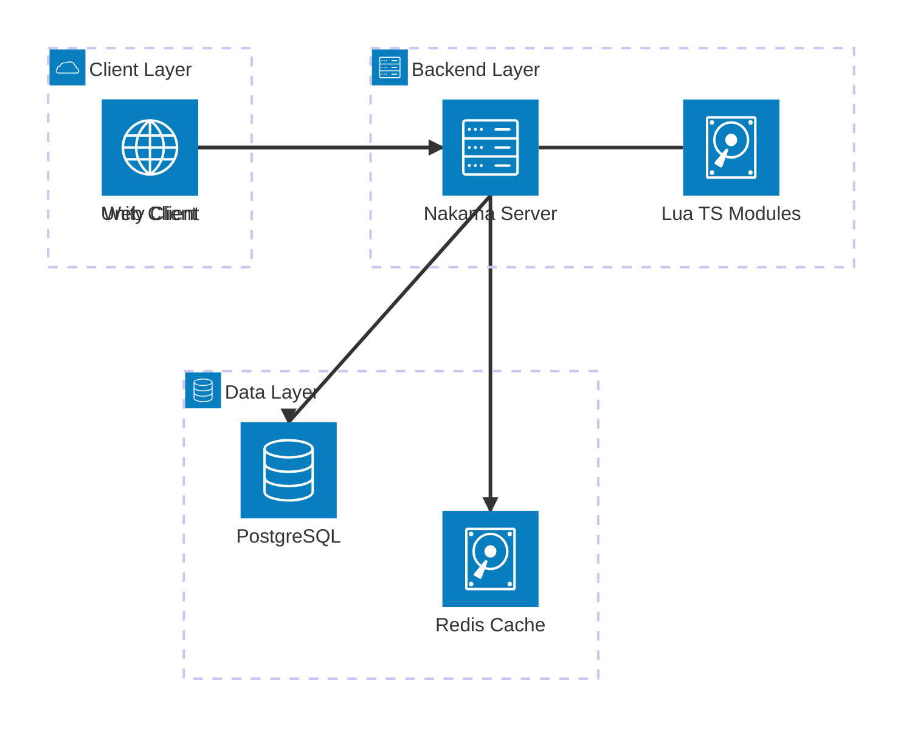
```mermaid
architecture-beta
    group client(cloud)[Client Layer]
    group backend(server)[Backend Layer]
    group data(database)[Data Layer]

    service unity(server)[Unity Client] in client
    service web(internet)[Web Client] in client

    service nakama(server)[Nakama Server] in backend
    service lua(disk)[Lua TS Modules] in backend

    service pg(database)[PostgreSQL] in data
    service redis(disk)[Redis Cache] in data

    unity:R --> L:nakama
    web:R --> L:nakama
    nakama:R -- L:lua
    nakama:B --> T:pg
    nakama:B --> T:redis
```

### 1.2 请求分类与路由

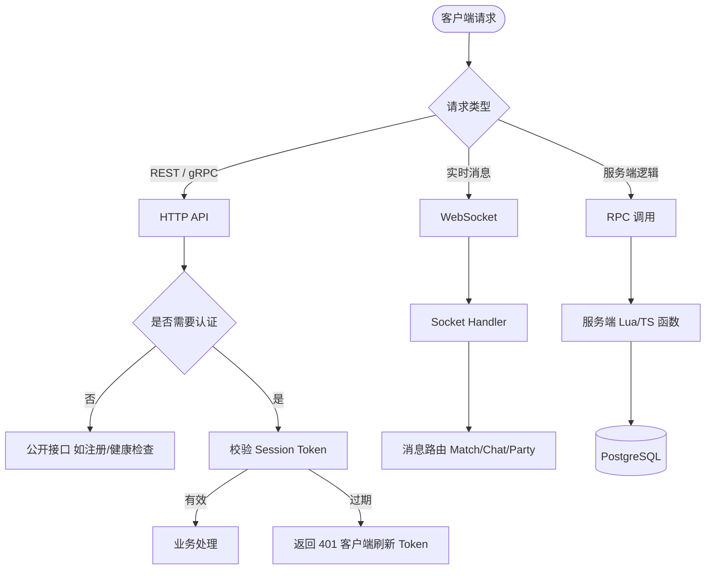
```mermaid
flowchart TD
    C([客户端请求]) --> T{请求类型}

    T -->|REST / gRPC| H[HTTP API]
    T -->|实时消息| S[WebSocket]
    T -->|服务端逻辑| R[RPC 调用]

    H --> A{是否需要认证}
    A -->|否| P["公开接口 如注册/健康检查"]
    A -->|是| V[校验 Session Token]
    V -->|有效| B[业务处理]
    V -->|过期| RE["返回 401 客户端刷新 Token"]

    S --> WS[Socket Handler]
    WS --> M["消息路由 Match/Chat/Party"]

    R --> RPC["服务端 Lua/TS 函数"]
    RPC --> DB[(PostgreSQL)]
```

---

## 2. 客户端连接生命周期

### 2.1 完整连接时序

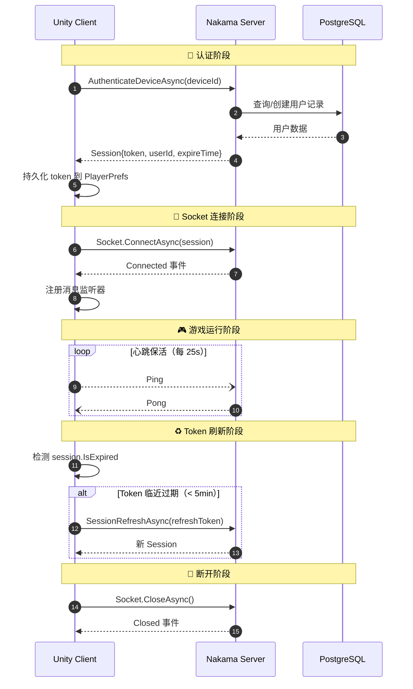
```mermaid
sequenceDiagram
    autonumber
    participant U as Unity Client
    participant N as Nakama Server
    participant DB as PostgreSQL

    Note over U,DB: 🔑 认证阶段
    U->>N: AuthenticateDeviceAsync(deviceId)
    N->>DB: 查询/创建用户记录
    DB-->>N: 用户数据
    N-->>U: Session{token, userId, expireTime}
    U->>U: 持久化 token 到 PlayerPrefs

    Note over U,DB: 🔌 Socket 连接阶段
    U->>N: Socket.ConnectAsync(session)
    N-->>U: Connected 事件
    U->>U: 注册消息监听器

    Note over U,DB: 🎮 游戏运行阶段
    loop 心跳保活（每 25s）
        U--)N: Ping
        N--)U: Pong
    end

    Note over U,DB: ♻️ Token 刷新阶段
    U->>U: 检测 session.IsExpired
    alt Token 临近过期（< 5min）
        U->>N: SessionRefreshAsync(refreshToken)
        N-->>U: 新 Session
    end

    Note over U,DB: 👋 断开阶段
    U->>N: Socket.CloseAsync()
    N-->>U: Closed 事件
```

### 2.2 Session 状态机

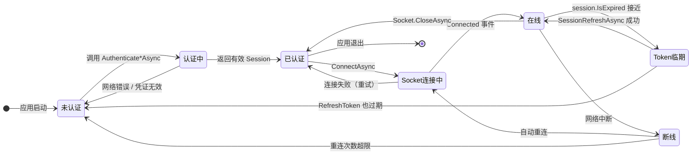
```mermaid
stateDiagram-v2
    direction LR

    [*] --> 未认证 : 应用启动

    未认证 --> 认证中 : 调用 Authenticate*Async
    认证中 --> 已认证 : 返回有效 Session
    认证中 --> 未认证 : 网络错误 / 凭证无效

    已认证 --> Socket连接中 : ConnectAsync
    Socket连接中 --> 在线 : Connected 事件
    Socket连接中 --> 已认证 : 连接失败（重试）

    在线 --> Token临期 : session.IsExpired 接近
    Token临期 --> 在线 : SessionRefreshAsync 成功
    Token临期 --> 未认证 : RefreshToken 也过期

    在线 --> 断线 : 网络中断
    断线 --> Socket连接中 : 自动重连
    断线 --> 未认证 : 重连次数超限

    在线 --> 已认证 : Socket.CloseAsync
    已认证 --> [*] : 应用退出
```

---

## 3. Session 管理

### 3.1 最佳实践：启动时恢复 Session

```csharp
// ✅ 推荐：优先尝试恢复缓存 Token，避免重复登录
private async Task<ISession> RestoreOrAuthAsync()
{
    const string tokenKey    = "nakama.token";
    const string refreshKey  = "nakama.refresh_token";

    var authToken    = PlayerPrefs.GetString(tokenKey,    "");
    var refreshToken = PlayerPrefs.GetString(refreshKey,  "");

    // 1. 尝试恢复 Session
    if (!string.IsNullOrEmpty(authToken))
    {
        var session = Session.Restore(authToken, refreshToken);

        // 2. Token 仍有效（且距过期 > 5 分钟）
        if (!session.IsExpired && session.HasExpired(DateTime.UtcNow.AddMinutes(5)) == false)
            return session;

        // 3. AuthToken 过期但 RefreshToken 有效 → 刷新
        if (!session.IsRefreshExpired)
        {
            try
            {
                session = await _client.SessionRefreshAsync(session);
                CacheSession(session);   // 更新缓存
                return session;
            }
            catch { /* 刷新失败，走重新认证流程 */ }
        }
    }

    // 4. 全部失效 → 重新登录
    var newSession = await _client.AuthenticateDeviceAsync(GetDeviceId(), create: true);
    CacheSession(newSession);
    return newSession;
}

private static void CacheSession(ISession s)
{
    PlayerPrefs.SetString("nakama.token",         s.AuthToken);
    PlayerPrefs.SetString("nakama.refresh_token", s.RefreshToken);
    PlayerPrefs.Save();
}
```

### 3.2 Token 生命周期参考

| Token 类型 | 默认有效期 | 建议配置（生产）| 刷新方式 |
|-----------|-----------|--------------|--------|
| Auth Token | 60 秒 | 1 小时 | `SessionRefreshAsync` |
| Refresh Token | 3600 秒 | 7 天 | 重新登录 |

> 在 `nakama.yml` 中调整：
> ```yaml
> console:
>   session_duration_sec: 3600      # Auth Token 有效期
>   refresh_token_duration_sec: 604800  # Refresh Token 有效期（7 天）
> ```

---

## 4. Storage 存档设计

### 4.1 数据模型设计原则

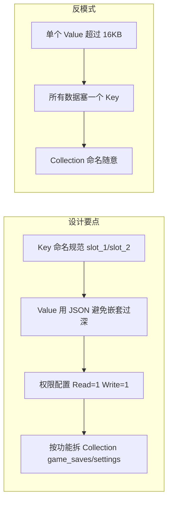
```mermaid
flowchart LR
    subgraph good[设计要点]
        direction TB
        K["Key 命名规范 slot_1/slot_2"] --> V["Value 用 JSON 避免嵌套过深"]
        V --> P["权限配置 Read=1 Write=1"]
        P --> Sg["按功能拆 Collection game_saves/settings"]
    end

    subgraph bad[反模式]
        direction TB
        B1["单个 Value 超过 16KB"] --> B2["所有数据塞一个 Key"]
        B2 --> B3["Collection 命名随意"]
    end
```

### 4.2 Collection 规划建议

| Collection | Key 格式 | 说明 | Read | Write |
|-----------|---------|------|------|-------|
| `game_saves` | `slot_{n}` | 游戏存档，多槽位 | 1（私有）| 1 |
| `player_settings` | `graphics` / `audio` | 本地设置同步 | 1 | 1 |
| `player_stats` | `lifetime` | 累计战绩，防篡改 | 2（公开）| 0（服务端写）|
| `leaderboard_meta` | `profile` | 排行榜附加信息 | 2 | 0 |

### 4.3 写入冲突处理（乐观锁）

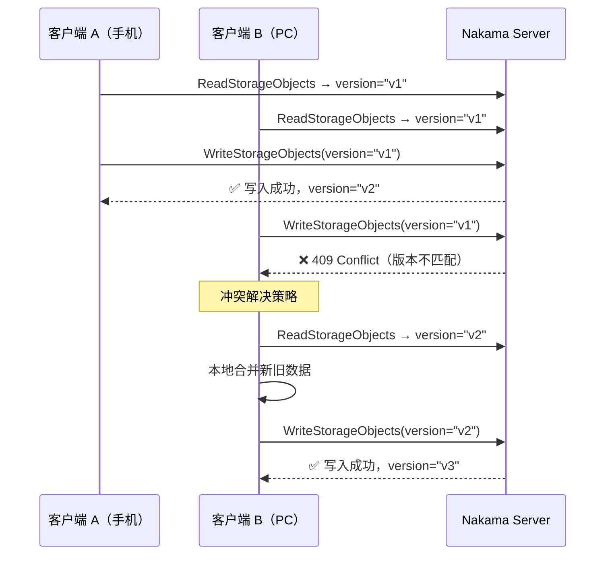
```mermaid
sequenceDiagram
    participant C1 as 客户端 A（手机）
    participant C2 as 客户端 B（PC）
    participant N as Nakama Server

    C1->>N: ReadStorageObjects → version="v1"
    C2->>N: ReadStorageObjects → version="v1"

    C1->>N: WriteStorageObjects(version="v1")
    N-->>C1: ✅ 写入成功，version="v2"

    C2->>N: WriteStorageObjects(version="v1")
    N-->>C2: ❌ 409 Conflict（版本不匹配）

    Note over C2: 冲突解决策略
    C2->>N: ReadStorageObjects → version="v2"
    C2->>C2: 本地合并新旧数据
    C2->>N: WriteStorageObjects(version="v2")
    N-->>C2: ✅ 写入成功，version="v3"
```

> **建议**：写入时传入 `version` 字段启用乐观锁，防止多端存档互相覆盖。

---

## 5. 排行榜运维

### 5.1 排行榜生命周期

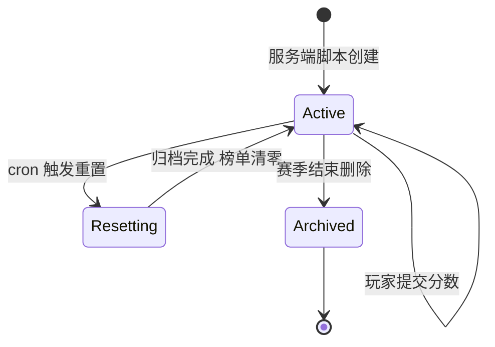
```mermaid
stateDiagram-v2
    [*] --> Active : 服务端脚本创建
    Active --> Resetting : cron 触发重置
    Resetting --> Active : 归档完成 榜单清零
    Active --> Archived : 赛季结束删除
    Archived --> [*]
    Active --> Active : 玩家提交分数
```

### 5.2 分数提交流程（防作弊）

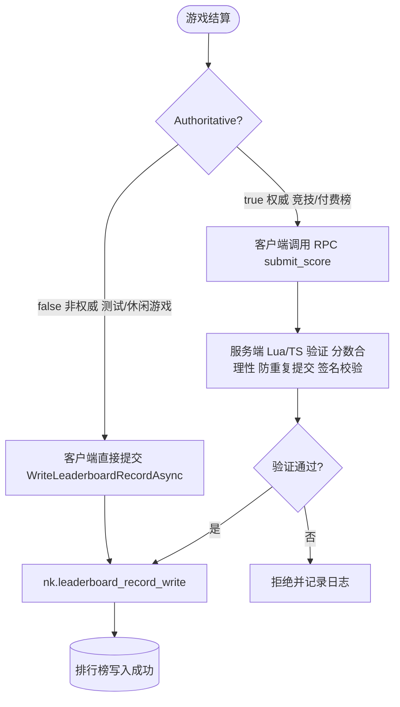
```mermaid
flowchart TD
    G([游戏结算]) --> C{Authoritative?}

    C -->|"false 非权威 测试/休闲游戏"| D["客户端直接提交 WriteLeaderboardRecordAsync"]
    C -->|"true 权威 竞技/付费榜"| E["客户端调用 RPC submit_score"]

    E --> F["服务端 Lua/TS 验证 分数合理性 防重复提交 签名校验"]
    F --> G2{验证通过?}
    G2 -->|是| H[nk.leaderboard_record_write]
    G2 -->|否| I[拒绝并记录日志]

    D --> H
    H --> J[(排行榜写入成功)]
```

### 5.3 Operator 选择指南

| Operator | 适用场景 | 示例 |
|---------|---------|------|
| `best` | 保留历史最高分 | 关卡最高分、PB 记录 |
| `incr` | 累计叠加 | 总击杀数、累计登录天数 |
| `set` | 直接覆盖 | 当前等级、当前段位 |
| `decr` | 最低值保留 | 最快通关时间 |

---

## 6. 实时通信与 Socket

### 6.1 断线重连策略

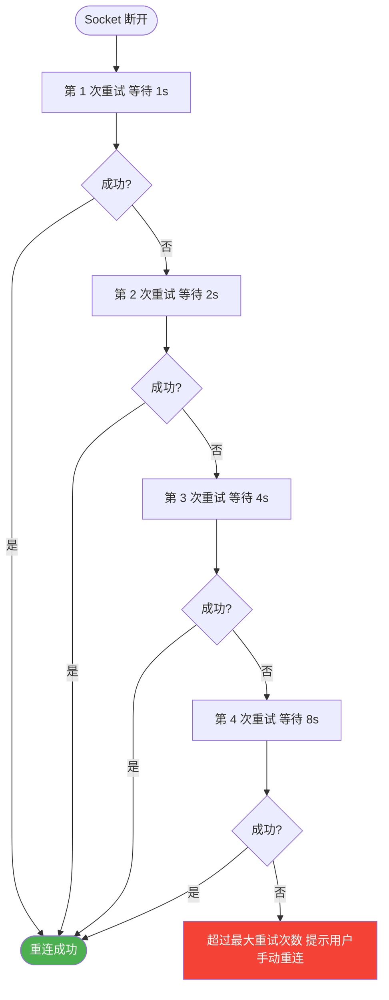
```mermaid
flowchart TD
    S([Socket 断开]) --> R1["第 1 次重试 等待 1s"]
    R1 --> A1{成功?}
    A1 -->|是| OK([重连成功])
    A1 -->|否| R2["第 2 次重试 等待 2s"]
    R2 --> A2{成功?}
    A2 -->|是| OK
    A2 -->|否| R3["第 3 次重试 等待 4s"]
    R3 --> A3{成功?}
    A3 -->|是| OK
    A3 -->|否| R4["第 4 次重试 等待 8s"]
    R4 --> A4{成功?}
    A4 -->|是| OK
    A4 -->|否| FAIL["超过最大重试次数 提示用户手动重连"]

    style OK fill:#4caf50,color:#fff
    style FAIL fill:#f44336,color:#fff
```

> 采用**指数退避**（1→2→4→8s），避免服务端瞬间雪崩。最大重试次数建议设为 5 次。

### 6.2 Socket 事件完整处理

```csharp
// ✅ 生产级 Socket 初始化
private void SetupSocket(ISocket socket)
{
    socket.Connected      += () => OnConnected();
    socket.Closed         += reason => OnClosed(reason);
    socket.ReceivedError  += ex => OnError(ex);

    // 实时对战
    socket.ReceivedMatchmakerMatched += OnMatchmakerMatched;
    socket.ReceivedMatchState        += OnMatchState;

    // 聊天
    socket.ReceivedChannelMessage    += OnChannelMessage;

    // 通知
    socket.ReceivedNotification      += OnNotification;

    // 状态同步
    socket.ReceivedStatusPresence    += OnStatusPresence;
}
```

---

## 7. 错误处理与重试策略

### 7.1 HTTP 状态码处理矩阵

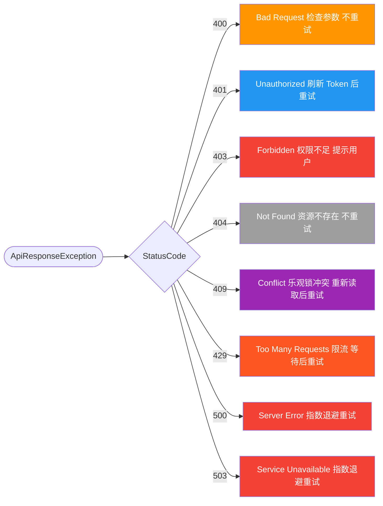
```mermaid
flowchart LR
    E([ApiResponseException]) --> SC{StatusCode}

    SC -->|400| BAD["Bad Request 检查参数 不重试"]
    SC -->|401| UNAUTH["Unauthorized 刷新 Token 后重试"]
    SC -->|403| FORBID["Forbidden 权限不足 提示用户"]
    SC -->|404| NF["Not Found 资源不存在 不重试"]
    SC -->|409| CONF["Conflict 乐观锁冲突 重新读取后重试"]
    SC -->|429| RATE["Too Many Requests 限流 等待后重试"]
    SC -->|500| SVR["Server Error 指数退避重试"]
    SC -->|503| DOWN["Service Unavailable 指数退避重试"]

    style BAD fill:#ff9800,color:#fff
    style UNAUTH fill:#2196f3,color:#fff
    style FORBID fill:#f44336,color:#fff
    style NF fill:#9e9e9e,color:#fff
    style CONF fill:#9c27b0,color:#fff
    style RATE fill:#ff5722,color:#fff
    style SVR fill:#f44336,color:#fff
    style DOWN fill:#f44336,color:#fff
```

### 7.2 全局重试配置

```csharp
// ✅ 推荐：在 Connector 初始化时配置全局重试
Client = new Client(scheme, host, port, serverKey, UnityWebRequestAdapter.Instance);

// 指数退避：基础延迟 1s，最多重试 5 次
Client.GlobalRetryConfiguration = new RetryConfiguration(
    baseDelay: 1,
    maxRetries: 5,
    listener: (attempt) => Debug.Log($"[Nakama] 第 {attempt} 次重试...")
);
```

### 7.3 不可重试请求列表

| 接口 | 原因 |
|------|------|
| 写入排行榜 | 幂等性未保证，重试可能导致重复计分 |
| 发送聊天消息 | 用户可见，重复发送影响体验 |
| 扣减虚拟货币 | 财务操作，必须服务端幂等校验 |
| 创建房间 | 可能创建多个重复房间 |

---

## 8. 安全与权限

### 8.1 权限模型

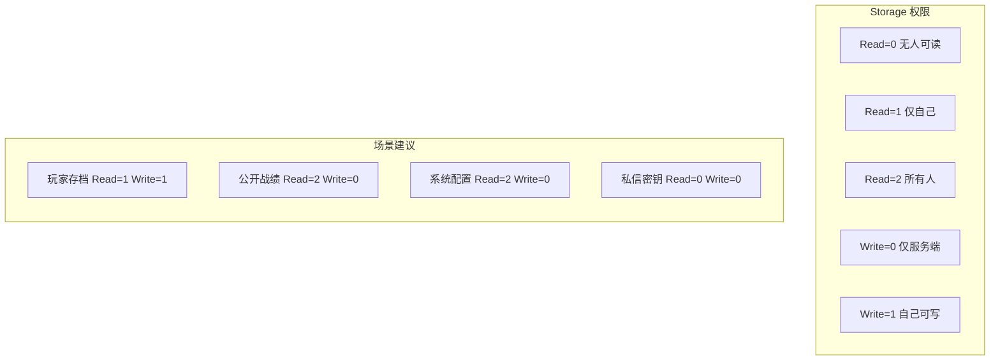
```mermaid
flowchart TD
    subgraph perms[Storage 权限]
        direction LR
        R0["Read=0 无人可读"]
        R1["Read=1 仅自己"]
        R2["Read=2 所有人"]
        W0["Write=0 仅服务端"]
        W1["Write=1 自己可写"]
    end

    subgraph cases[场景建议]
        direction TB
        S1["玩家存档 Read=1 Write=1"]
        S2["公开战绩 Read=2 Write=0"]
        S3["系统配置 Read=2 Write=0"]
        S4["私信密钥 Read=0 Write=0"]
    end
```

### 8.2 Server Key 安全

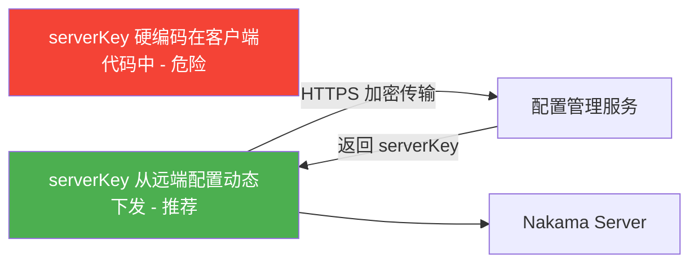
```mermaid
flowchart LR
    K1["serverKey 硬编码在客户端代码中 - 危险"]
    K2["serverKey 从远端配置动态下发 - 推荐"]
    N[Nakama Server]
    CM[配置管理服务]

    K2 -->|HTTPS 加密传输| CM
    CM -->|返回 serverKey| K2
    K2 --> N

    style K1 fill:#f44336,color:#fff
    style K2 fill:#4caf50,color:#fff
```

> ⚠️ **警告**：`serverKey` 不应硬编码在客户端中。生产环境应通过远端配置（如 Firebase Remote Config）动态下发，并定期轮换。

---

## 9. 服务端部署架构

### 9.1 单机部署（小型项目 / 开发测试）

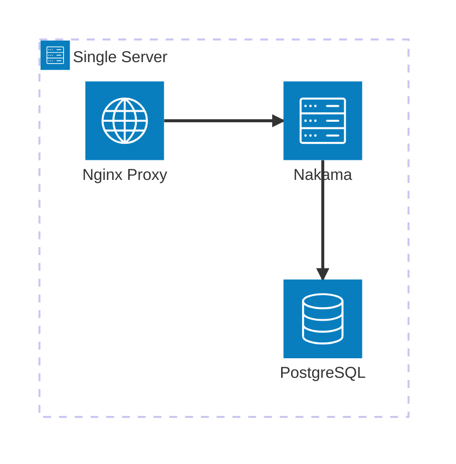
```mermaid
architecture-beta
    group host(server)[Single Server]

    service nginx(internet)[Nginx Proxy] in host
    service nakama(server)[Nakama] in host
    service pg(database)[PostgreSQL] in host

    nginx:R --> L:nakama
    nakama:B --> T:pg
```

### 9.2 生产高可用部署

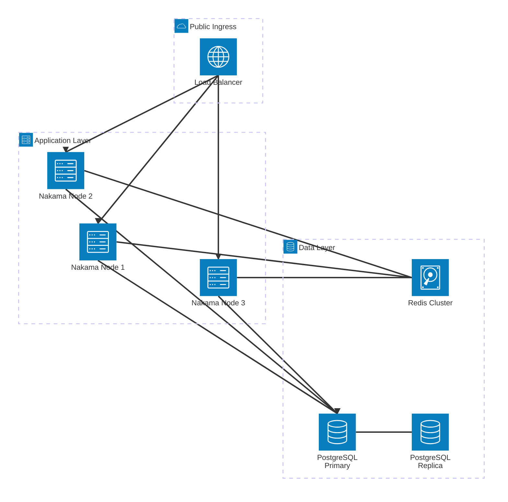
```mermaid
architecture-beta
    group internet(cloud)[Public Ingress]
    group app(server)[Application Layer]
    group data(database)[Data Layer]

    service lb(internet)[Load Balancer] in internet

    service n1(server)[Nakama Node 1] in app
    service n2(server)[Nakama Node 2] in app
    service n3(server)[Nakama Node 3] in app

    service pg_primary(database)[PostgreSQL Primary] in data
    service pg_replica(database)[PostgreSQL Replica] in data
    service redis(disk)[Redis Cluster] in data

    lb:B --> T:n1
    lb:B --> T:n2
    lb:B --> T:n3

    n1:B --> T:pg_primary
    n2:B --> T:pg_primary
    n3:B --> T:pg_primary

    pg_primary:R -- L:pg_replica

    n1:R -- L:redis
    n2:R -- L:redis
    n3:R -- L:redis
```

### 9.3 Docker Compose 快速参考

```yaml
# docker-compose.yml（生产简化版）
version: "3"
services:
  nakama:
    image: heroiclabs/nakama:3.21.1
    restart: unless-stopped
    ports:
      - "7349:7349"   # gRPC
      - "7350:7350"   # HTTP API
      - "7351:7351"   # Console
    environment:
      - NAKAMA_DB_ADDRESS=postgres:5432
    depends_on:
      postgres:
        condition: service_healthy
    volumes:
      - ./data/modules:/nakama/data/modules   # Lua/TS 脚本挂载

  postgres:
    image: postgres:14
    restart: unless-stopped
    environment:
      POSTGRES_DB: nakama
      POSTGRES_USER: postgres
      POSTGRES_PASSWORD: "${PG_PASSWORD}"     # 使用 .env 注入，禁止明文
    volumes:
      - pg_data:/var/lib/postgresql/data
    healthcheck:
      test: ["CMD", "pg_isready", "-U", "postgres"]
      interval: 5s
      timeout: 5s
      retries: 5

volumes:
  pg_data:
```

---

## 10. 监控与告警

### 10.1 关键监控指标

| 指标 | 告警阈值 | 说明 |
|------|---------|------|
| 在线 Session 数 | > 80% 容量 | 提前扩容 |
| API 平均响应时间 | > 500ms | 检查 DB 查询 |
| API 错误率（5xx）| > 1% | 立即介入 |
| WebSocket 连接数 | > 设计上限 | 扩容 |
| PostgreSQL 连接池使用率 | > 80% | 调大 pool_max |
| 磁盘使用率 | > 75% | 清理日志 / 扩盘 |

### 10.2 告警响应流程

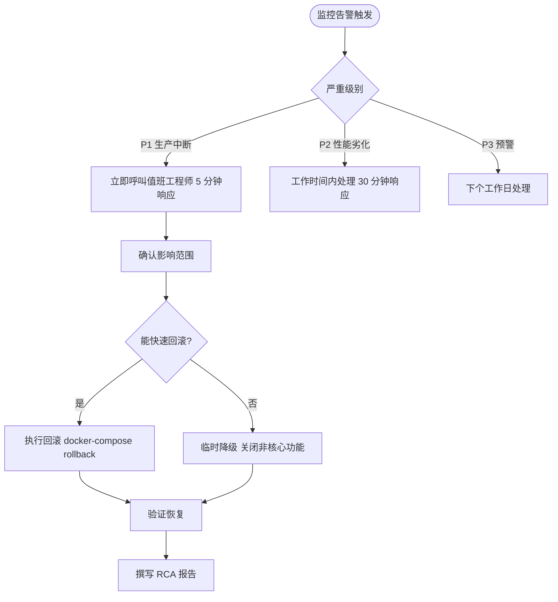
```mermaid
flowchart TD
    A([监控告警触发]) --> S{严重级别}

    S -->|P1 生产中断| P1["立即呼叫值班工程师 5 分钟响应"]
    S -->|P2 性能劣化| P2["工作时间内处理 30 分钟响应"]
    S -->|P3 预警| P3[下个工作日处理]

    P1 --> D1[确认影响范围]
    D1 --> D2{能快速回滚?}
    D2 -->|是| D3["执行回滚 docker-compose rollback"]
    D2 -->|否| D4["临时降级 关闭非核心功能"]
    D3 --> D5[验证恢复]
    D4 --> D5
    D5 --> D6[撰写 RCA 报告]
```

### 10.3 Prometheus 指标采集（nakama.yml）

```yaml
# nakama.yml 开启 metrics
metrics:
  prometheus_port: 9100     # Prometheus 拉取端口
  prefix: "nakama"          # 指标前缀
  reporting_freq_sec: 60    # 上报频率
```

---

## 11. 运维操作手册

### 11.1 日常操作速查

| 操作 | 命令 | 说明 |
|------|------|------|
| 启动服务 | `docker-compose up -d` | 后台启动 |
| 查看日志 | `docker-compose logs -f nakama` | 实时日志 |
| 重启 Nakama | `docker-compose restart nakama` | 不重启 DB |
| 数据库迁移 | `nakama migrate up` | 版本升级前执行 |
| 备份数据库 | `pg_dump -U postgres nakama > backup.sql` | 定期备份 |
| 查看在线人数 | Console → Dashboard → Sessions | 控制台查看 |
| 踢出玩家 | Console → Players → Disconnect | 紧急处置 |

### 11.2 版本升级流程

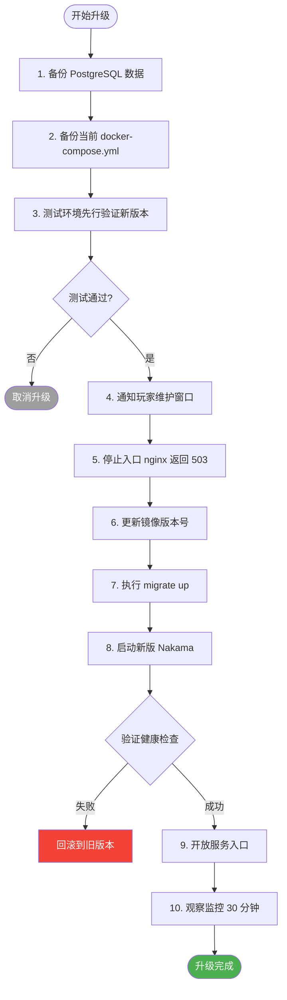
```mermaid
flowchart TD
    Start([开始升级]) --> B1[1. 备份 PostgreSQL 数据]
    B1 --> B2[2. 备份当前 docker-compose.yml]
    B2 --> B3[3. 测试环境先行验证新版本]
    B3 --> B4{测试通过?}
    B4 -->|否| STOP([取消升级])
    B4 -->|是| B5[4. 通知玩家维护窗口]
    B5 --> B6["5. 停止入口 nginx 返回 503"]
    B6 --> B7[6. 更新镜像版本号]
    B7 --> B8[7. 执行 migrate up]
    B8 --> B9[8. 启动新版 Nakama]
    B9 --> B10{验证健康检查}
    B10 -->|失败| B11[回滚到旧版本]
    B10 -->|成功| B12[9. 开放服务入口]
    B12 --> B13[10. 观察监控 30 分钟]
    B13 --> End([升级完成])

    style STOP fill:#9e9e9e,color:#fff
    style B11 fill:#f44336,color:#fff
    style End fill:#4caf50,color:#fff
```

### 11.3 核心配置文件速查（nakama.yml）

```yaml
name: nakama_node_1          # 节点名（集群中唯一）

logger:
  level: warn                # 生产用 warn，调试用 debug

database:
  address:                   # PostgreSQL 连接地址
    - postgres:5432
  conn_max_lifetime_ms: 60000
  max_open_conns: 100        # 根据 DB 实例规格调整

socket:
  max_message_size_bytes: 4096  # 单条消息上限
  idle_timeout_ms: 60000        # 连接空闲超时
  write_wait_ms: 5000

runtime:
  path: /nakama/data/modules   # 服务端脚本目录
  http_key: "your_http_key"    # RPC HTTP 鉴权密钥

session:
  token_expiry_sec: 3600       # Auth Token 1小时
  refresh_token_expiry_sec: 604800  # Refresh Token 7天

console:
  port: 7351
  username: admin
  password: "${CONSOLE_PASSWORD}"   # 使用环境变量，禁止明文
```

---

## 12. IAP 内购支付

> Nakama 本身不直接处理支付，而是作为**收据验证中间层**：客户端先完成平台支付，再将收据发给 Nakama 服务端验证后发放道具。

### 12.1 整体流程

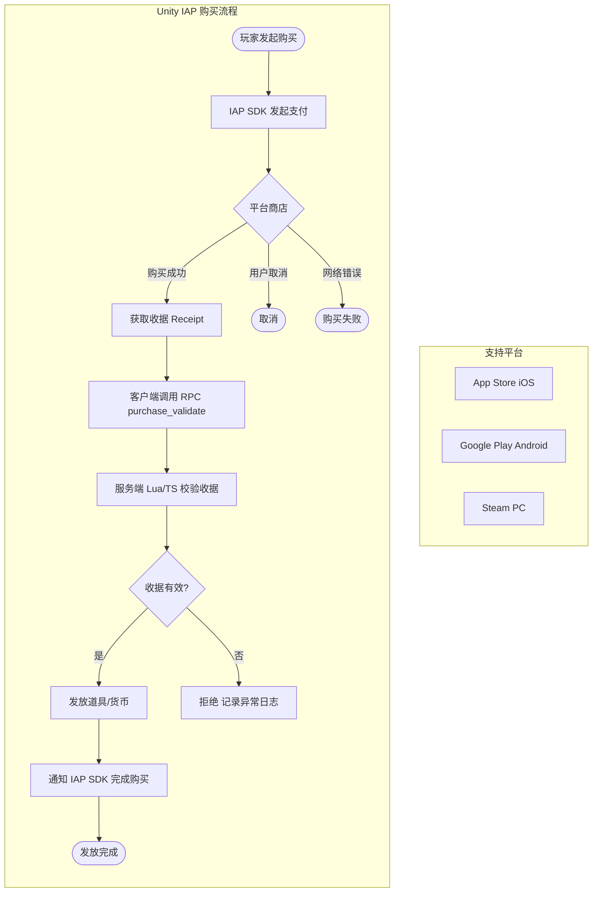
```mermaid
flowchart TD
    subgraph platforms[支持平台]
        direction LR
        IOS[App Store iOS]
        AND[Google Play Android]
        PC[Steam PC]
    end

    subgraph flow[Unity IAP 购买流程]
        direction TB
        U([玩家发起购买]) --> PUR[IAP SDK 发起支付]
        PUR --> STORE{平台商店}
        STORE -->|购买成功| RECEIPT[获取收据 Receipt]
        STORE -->|用户取消| CANCEL([取消])
        STORE -->|网络错误| ERR([购买失败])
        RECEIPT --> RPC["客户端调用 RPC purchase_validate"]
        RPC --> SERVER["服务端 Lua/TS 校验收据"]
        SERVER --> VERIFY{收据有效?}
        VERIFY -->|是| GRANT[发放道具/货币]
        VERIFY -->|否| REJECT[拒绝 记录异常日志]
        GRANT --> ACK[通知 IAP SDK 完成购买]
        ACK --> DONE([发放完成])
    end
```

### 12.2 完整时序：服务端收据验证

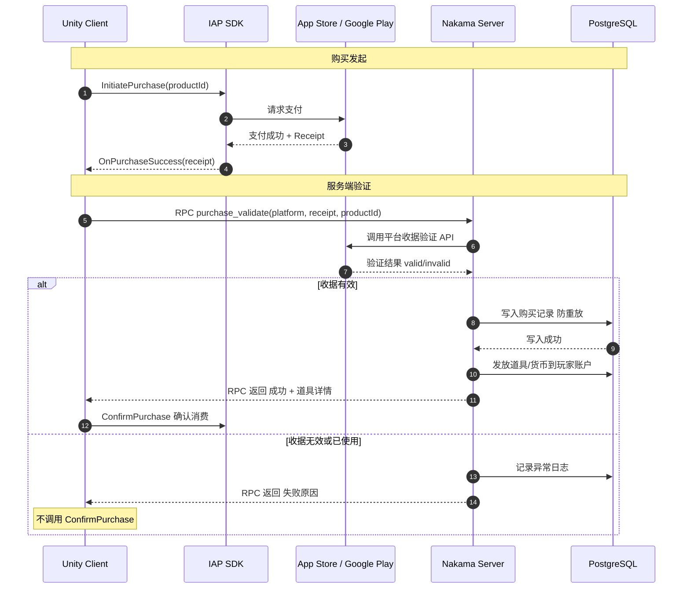
```mermaid
sequenceDiagram
    autonumber
    participant U as Unity Client
    participant IAP as IAP SDK
    participant ST as App Store / Google Play
    participant N as Nakama Server
    participant DB as PostgreSQL

    Note over U,DB: 购买发起
    U->>IAP: InitiatePurchase(productId)
    IAP->>ST: 请求支付
    ST-->>IAP: 支付成功 + Receipt
    IAP-->>U: OnPurchaseSuccess(receipt)

    Note over U,DB: 服务端验证
    U->>N: RPC purchase_validate(platform, receipt, productId)
    N->>ST: 调用平台收据验证 API
    ST-->>N: 验证结果 valid/invalid

    alt 收据有效
        N->>DB: 写入购买记录 防重放
        DB-->>N: 写入成功
        N->>DB: 发放道具/货币到玩家账户
        N-->>U: RPC 返回 成功 + 道具详情
        U->>IAP: ConfirmPurchase 确认消费
    else 收据无效或已使用
        N->>DB: 记录异常日志
        N-->>U: RPC 返回 失败原因
        Note over U: 不调用 ConfirmPurchase
    end
```

### 12.2b 深度时序：含 Lua 内部执行细节

> 展示从 Unity 到 Nakama Lua Runtime，再到平台 API、Storage、Wallet 的完整调用链。

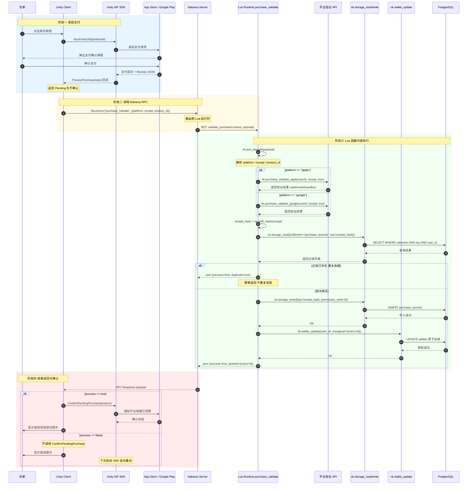
```mermaid
sequenceDiagram
    autonumber
    participant Player as 玩家
    participant Unity as Unity Client
    participant IAPSDK as Unity IAP SDK
    participant Store as App Store / Google Play
    participant Nakama as Nakama Server
    participant Lua as Lua Runtime purchase_validate
    participant StoreAPI as 平台验证 API
    participant Storage as nk.storage_read/write
    participant Wallet as nk.wallet_update
    participant DB as PostgreSQL

    %% =========== 阶段一：发起支付 ===========
    rect rgb(230, 245, 255)
        Note over Player,IAPSDK: 阶段一  发起支付
        Player->>Unity: 点击购买按钮
        Unity->>IAPSDK: BuyProductID(productId)
        IAPSDK->>Store: 发起支付请求
        Store-->>Player: 弹出支付确认弹窗
        Player->>Store: 确认支付
        Store-->>IAPSDK: 支付成功 + Receipt JSON
        IAPSDK-->>Unity: ProcessPurchase(args) 回调
        Note over Unity: 返回 Pending 先不确认
    end

    %% =========== 阶段二：RPC 调用 ===========
    rect rgb(255, 250, 230)
        Note over Unity,Nakama: 阶段二  调用 Nakama RPC
        Unity->>Nakama: RpcAsync("purchase_validate", {platform, receipt, product_id})
        Note over Nakama: 路由到 Lua 运行时
        Nakama->>Lua: 执行 validate_purchase(context, payload)
    end

    %% =========== 阶段三：Lua 内部逻辑 ===========
    rect rgb(240, 255, 240)
        Note over Lua,DB: 阶段三  Lua 函数内部执行

        Lua->>Lua: nk.json_decode(payload)
        Note over Lua: 解析 platform / receipt / product_id

        alt platform == "apple"
            Lua->>StoreAPI: nk.purchase_validate_apple(userId, receipt, true)
            StoreAPI-->>Lua: 返回验证结果 valid/invalid/sandbox
        else platform == "google"
            Lua->>StoreAPI: nk.purchase_validate_google(userId, receipt, true)
            StoreAPI-->>Lua: 返回验证结果
        end

        Lua->>Lua: receipt_hash = nk.md5_hash(receipt)

        Lua->>Storage: nk.storage_read({collection="purchase_records", key=receipt_hash})
        Storage->>DB: SELECT WHERE collection AND key AND user_id
        DB-->>Storage: 查询结果
        Storage-->>Lua: 返回记录列表

        alt 记录已存在 重复收据
            Lua-->>Nakama: json {success=true, duplicate=true}
            Note over Lua: 幂等返回 不重复发放
        else 首次购买
            Lua->>Storage: nk.storage_write({key=receipt_hash, permission_write=0})
            Storage->>DB: INSERT purchase_records
            DB-->>Storage: 写入成功
            Storage-->>Lua: OK

            Lua->>Wallet: nk.wallet_update({user_id, changeset={coins=N}})
            Wallet->>DB: UPDATE wallets 原子加减
            DB-->>Wallet: 更新成功
            Wallet-->>Lua: OK

            Lua-->>Nakama: json {success=true, granted={coins=N}}
        end
    end

    %% =========== 阶段四：结果返回 ===========
    rect rgb(255, 235, 235)
        Note over Unity,Player: 阶段四  结果返回与确认

        Nakama-->>Unity: RPC Response payload

        alt success == true
            Unity->>IAPSDK: ConfirmPendingPurchase(product)
            IAPSDK->>Store: 通知平台收据已消费
            Store-->>IAPSDK: 确认完成
            Unity->>Player: 显示道具发放成功提示
        else success == false
            Note over Unity: 不调用 ConfirmPendingPurchase
            Unity->>Player: 显示错误提示
            Note over IAPSDK: 下次启动 SDK 自动重试
        end
    end
```

### 12.3 幂等性与防重放

**核心原则**：同一张收据绝对不能发放两次道具。

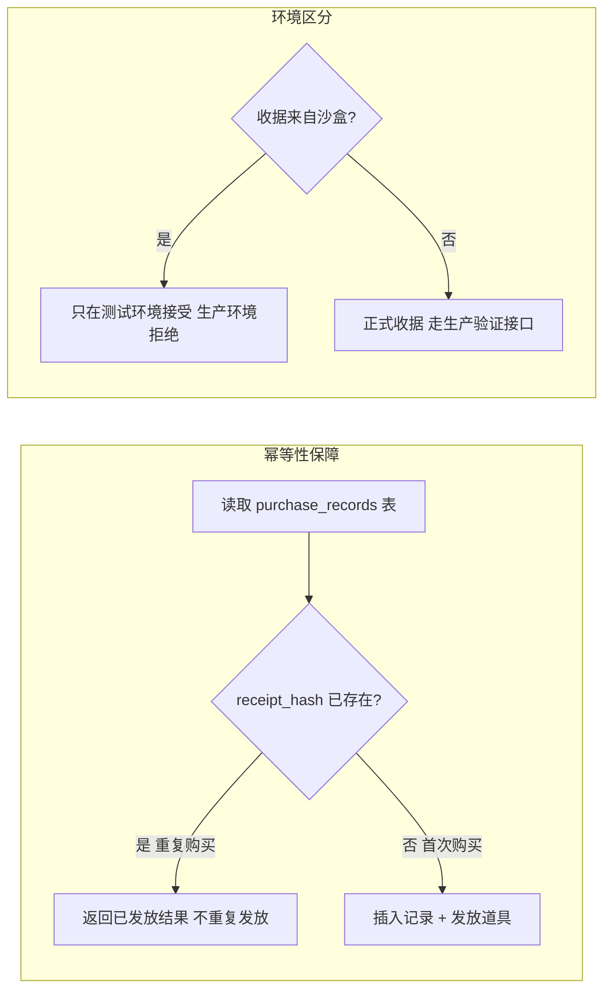
```mermaid
flowchart LR
    subgraph idempotent[幂等性保障]
        direction TB
        R1["读取 purchase_records 表"] --> R2{receipt_hash 已存在?}
        R2 -->|是 重复购买| R3["返回已发放结果 不重复发放"]
        R2 -->|否 首次购买| R4["插入记录 + 发放道具"]
    end

    subgraph sandbox[环境区分]
        direction TB
        S1{收据来自沙盒?} -->|是| S2["只在测试环境接受 生产环境拒绝"]
        S1 -->|否| S3["正式收据 走生产验证接口"]
    end
```

### 12.4 商品配置表：三端一致性方案

> **核心问题**：Product ID 需要在 Apple/Google 后台、Nakama 服务端、Unity 客户端三处完全相同，同时商品名称/道具量等信息也要一致——如何避免散落在各处、更新时漏改？

**解决方案：以 Nakama 服务端为唯一真相源（Single Source of Truth）**

```
Apple/Google 后台          Nakama 服务端（唯一真相源）         Unity 客户端
──────────────────         ──────────────────────────────      ─────────────────────────
只存：                      product_catalog.lua 存储：           启动时调用 RPC 拉取
  product_id（必须一致）      product_id → {                       MergedProduct 合并：
  本地化价格（平台强制）         display_name                        display_name  ← 服务端
  货币符号                     icon                                icon          ← 服务端
                               reward_type                         localizedPrice ← 平台
                               reward_amount                       rewardAmount  ← 服务端
                             }
```

#### 数据流向

```mermaid
flowchart TD
    subgraph truth[唯一真相源]
        CATALOG["product_catalog.lua\nCATALOG 表"]
    end

    subgraph server[Nakama 服务端]
        CATALOG --> RPC_CAT["RPC get_product_catalog\n返回配置表"]
        CATALOG --> RPC_VAL["RPC purchase_validate\n按配置表发放道具"]
    end

    subgraph client[Unity 客户端]
        IAP["Unity IAP SDK\n拉取平台价格/货币"]
        RPC_CAT --> MERGE["ProductCatalog.BuildAsync\n合并平台价格 + 服务端配置"]
        IAP --> MERGE
        MERGE --> UI["ShopUI\n展示商品列表"]
        MERGE --> BUY["IAPManager.BuyProduct\n发起购买"]
    end

    subgraph platform[Apple / Google 后台]
        STORE["App Store Connect\nGoogle Play Console\n只配置 product_id + 价格"]
        STORE --> IAP
    end

    style CATALOG fill:#4caf50,color:#fff
    style MERGE fill:#2196f3,color:#fff
```

#### 三端职责分工

| 层 | 谁是权威 | 存什么 | 不存什么 |
|----|---------|--------|---------|
| Apple/Google 后台 | 平台 | product_id（锚点）、本地化价格、货币符号 | 道具内容、商品描述、图标 |
| Nakama 服务端（CATALOG）| **唯一真相源** | product_id → 名称、图标、reward_type、reward_amount | 价格（平台决定）|
| Unity 客户端 | 无 | 运行时合并结果（不持久化） | 任何 product 配置 |

### 12.5 服务端 Lua 实现示例

```lua
-- data/modules/iap.lua
local nk = require("nakama")

-- ─────────────────────────────────────────────────────────────
-- 【唯一真相源】商品配置表
-- product_id 必须与 Apple/Google 后台完全一致
-- 客户端通过 get_product_catalog RPC 拉取此表用于 UI 展示
-- validate_purchase 也从此表查询道具内容，保证三端一致
-- ─────────────────────────────────────────────────────────────
local CATALOG = {
    ["com.game.coins_100"] = {
        display_name  = "金币 x100",
        description   = "小包金币",
        icon          = "icon_coins_small",
        reward_type   = "coins",
        reward_amount = 100,
        product_type  = "consumable",
    },
    ["com.game.coins_500"] = {
        display_name  = "金币 x500",
        description   = "中包金币（超值）",
        icon          = "icon_coins_medium",
        reward_type   = "coins",
        reward_amount = 500,
        product_type  = "consumable",
    },
    ["com.game.vip_month"] = {
        display_name  = "月卡 VIP",
        description   = "30天VIP特权",
        icon          = "icon_vip",
        reward_type   = "vip_days",
        reward_amount = 30,
        product_type  = "non_consumable",
    },
}

-- 购买记录 Collection
local PURCHASE_COLLECTION = "purchase_records"

-- ─────────────────────────────────────────────────────────────
-- RPC 1：客户端拉取商品配置表（用于 UI 展示）
-- ─────────────────────────────────────────────────────────────
local function get_product_catalog(context, payload)
    return nk.json_encode({ products = CATALOG })
end
nk.register_rpc(get_product_catalog, "get_product_catalog")

-- ─────────────────────────────────────────────────────────────
-- RPC 2：收据验证 + 道具发放（从同一 CATALOG 查询奖励内容）
-- ─────────────────────────────────────────────────────────────
local function validate_purchase(context, payload)
    local data = nk.json_decode(payload)
    local platform  = data.platform   -- "apple" | "google" | "steam"
    local receipt   = data.receipt
    local product_id = data.product_id

    -- 1. 调用 Nakama 内置收据验证
    local result, err
    if platform == "apple" then
        result, err = nk.purchase_validate_apple(context.user_id, receipt, true)
    elseif platform == "google" then
        result, err = nk.purchase_validate_google(context.user_id, receipt, true)
    else
        error("Unsupported platform: " .. platform)
    end

    if err ~= nil then
        error("Receipt validation failed: " .. tostring(err))
    end

    -- 2. 查询 CATALOG（与 UI 展示用同一份数据）
    local config = CATALOG[product_id]
    if config == nil then
        error("Unknown product: " .. product_id)
    end

    -- 3. 检查幂等性（防重放）
    local receipt_hash = nk.md5_hash(receipt)
    local existing = nk.storage_read({
        { collection = PURCHASE_COLLECTION, key = receipt_hash, user_id = context.user_id }
    })
    if #existing > 0 then
        return nk.json_encode({ success = true, duplicate = true })
    end

    -- 4. 写入购买记录
    nk.storage_write({
        {
            collection = PURCHASE_COLLECTION,
            key        = receipt_hash,
            user_id    = context.user_id,
            value      = { product_id = product_id, granted_at = os.time() },
            permission_read  = 1,
            permission_write = 0,
        }
    })

    -- 5. 按 CATALOG 发放道具
    if config.reward_type == "coins" then
        nk.wallet_update({
            { user_id = context.user_id,
              changeset = { coins = config.reward_amount },
              metadata  = { source = "iap", product_id = product_id } }
        })
    elseif config.reward_type == "vip_days" then
        -- 示例：写入 Storage 记录 VIP 到期时间
        nk.storage_write({
            {
                collection = "player_entitlements",
                key        = "vip",
                user_id    = context.user_id,
                value      = { days = config.reward_amount, granted_at = os.time() },
                permission_read  = 1,
                permission_write = 0,
            }
        })
    end

    return nk.json_encode({
        success  = true,
        duplicate = false,
        granted  = { type = config.reward_type, amount = config.reward_amount }
    })
end
nk.register_rpc(validate_purchase, "purchase_validate")
```

### 12.6 Unity 客户端集成示例

> `ProductCatalog` 从服务端拉取配置表，与 Unity IAP 平台价格合并后供 UI 使用。`IAPManager` 在初始化完成后调用 `ProductCatalog.BuildAsync`。

**ProductCatalog.cs（合并层）**

```csharp
// ProductCatalog.cs
using System;
using System.Collections.Generic;
using System.Collections.ObjectModel;
using System.Threading.Tasks;
using Nakama;
using UnityEngine;
using UnityEngine.Purchasing;

/// <summary>
/// 合并后的商品信息：平台价格（来自 Apple/Google）+ 服务端配置（来自 Nakama CATALOG）
/// </summary>
public class MergedProduct
{
    // ── 服务端字段（来自 CATALOG，可热更，无需发版）──
    public string ProductId     { get; set; }
    public string DisplayName   { get; set; }
    public string Description   { get; set; }
    public string Icon          { get; set; }
    public string RewardType    { get; set; }
    public int    RewardAmount  { get; set; }

    // ── 平台字段（来自 Apple/Google，客户端无法伪造）──
    public string  LocalizedPrice       { get; set; }   // "¥6.00"
    public decimal PriceDecimal         { get; set; }   // 6.00m
    public string  IsoCurrencyCode      { get; set; }   // "CNY"
    public bool    AvailableToPurchase  { get; set; }
}

/// <summary>
/// 商品目录管理器。
/// 调用时机：IAPManager.HandleProductsFetched 之后，在 OnIAPReady 事件触发前完成。
/// </summary>
public static class ProductCatalog
{
    public static List<MergedProduct> Products { get; private set; } = new();

    // ── Nakama RPC 返回的原始类型 ──
    [Serializable] private class ServerProductConfig
    {
        public string display_name;
        public string description;
        public string icon;
        public string reward_type;
        public int    reward_amount;
    }
    [Serializable] private class CatalogResponse
    {
        // JsonUtility 不支持 Dictionary，需要手动解析
        public string raw;
    }

    /// <summary>
    /// 从 Nakama 拉取 CATALOG，与 IAP 平台商品价格合并。
    /// 必须在 Unity IAP FetchProducts 完成（StoreController.GetProducts 可用）后调用。
    /// </summary>
    public static async Task BuildAsync(
        IClient client,
        ISession session,
        ReadOnlyObservableCollection<Product> iapProducts)
    {
        // 1. 从服务端拉取配置表
        Dictionary<string, ServerProductConfig> serverConfigs = new();
        try
        {
            var rpc = await client.RpcAsync(session, "get_product_catalog", "{}");
            // 使用 Newtonsoft.Json（需项目已引入）或手动解析
            var parsed = Newtonsoft.Json.JsonConvert.DeserializeObject<
                Newtonsoft.Json.Linq.JObject>(rpc.Payload);
            var productsNode = parsed?["products"];
            if (productsNode != null)
            {
                foreach (var kv in (Newtonsoft.Json.Linq.JObject)productsNode)
                {
                    serverConfigs[kv.Key] =
                        kv.Value.ToObject<ServerProductConfig>();
                }
            }
        }
        catch (Exception ex)
        {
            Debug.LogWarning($"[ProductCatalog] 拉取服务端配置失败，将使用纯平台数据: {ex.Message}");
        }

        // 2. 合并平台价格 + 服务端配置
        Products.Clear();
        foreach (var p in iapProducts)
        {
            serverConfigs.TryGetValue(p.definition.id, out var cfg);
            Products.Add(new MergedProduct
            {
                ProductId            = p.definition.id,
                DisplayName          = cfg?.display_name ?? p.definition.id,
                Description          = cfg?.description  ?? "",
                Icon                 = cfg?.icon          ?? "",
                RewardType           = cfg?.reward_type   ?? "",
                RewardAmount         = cfg?.reward_amount ?? 0,
                LocalizedPrice       = p.metadata.localizedPriceString,
                PriceDecimal         = p.metadata.localizedPrice,
                IsoCurrencyCode      = p.metadata.isoCurrencyCode,
                AvailableToPurchase  = p.availableToPurchase,
            });
        }
        Debug.Log($"[ProductCatalog] 合并完成，共 {Products.Count} 个商品。");
    }
}
```

**IAPManager 中的接入点（关键改动）**

```csharp
// IAPManager.cs — HandleProductsFetched 改为 async，拉取 catalog 后再 Ready
private async void HandleProductsFetched(List<Product> products)
{
    Debug.Log($"[IAP] 商品拉取成功，共 {products.Count} 个。");

    // ✅ 从服务端拉取配置表并合并
    await ProductCatalog.BuildAsync(
        Connector.Client,
        Connector.Session,
        _store.GetProducts());

    IsReady = true;
    OnIAPReady?.Invoke();   // 此时 ProductCatalog.Products 已就绪
}
```

**ShopUI 展示示例**

```csharp
// ShopUI.cs
void RefreshShop()
{
    foreach (var p in ProductCatalog.Products)
    {
        // p.DisplayName   ← 服务端 CATALOG，可热更
        // p.LocalizedPrice ← Apple/Google 实际价格，不可伪造
        // p.Icon          ← 服务端 CATALOG，客户端按 key 加载 Sprite
        // p.RewardAmount  ← 服务端 CATALOG，"购买即得 x100 金币"
        Debug.Log($"{p.DisplayName}  {p.LocalizedPrice}  → {p.RewardType} x{p.RewardAmount}");
    }
}
```

### 12.7 平台配置要求

| 平台 | 配置项 | 位置 |
|------|-------|------|
| Apple App Store | `iap.apple_bundle_id` | `nakama.yml` |
| Apple App Store | `iap.apple_shared_secret` | `nakama.yml`（订阅类商品必填）|
| Google Play | `iap.google_service_account` | JSON 服务账户密钥文件路径 |
| Google Play | `iap.google_package_name` | `nakama.yml` |

```yaml
# nakama.yml IAP 配置片段
iap:
  apple:
    bundle_id: "com.yourcompany.yourgame"
    shared_secret: "${APPLE_SHARED_SECRET}"   # 环境变量注入
  google:
    client_email: "${GOOGLE_CLIENT_EMAIL}"
    private_key:  "${GOOGLE_PRIVATE_KEY}"
    package_name: "com.yourcompany.yourgame"
```

### 12.8 关键注意事项

| 注意点 | 说明 |
|-------|------|
| **绝不在客户端验证** | 收据验证必须在服务端进行，客户端验证可被绕过 |
| **ConfirmPurchase 时机** | 必须等服务端成功发放后再确认，避免发放失败后收据被消费 |
| **沙盒收据隔离** | 测试环境收据不能流入生产，`nk.purchase_validate_apple` 第三个参数控制 |
| **钱包操作原子性** | 发放货币用 `nk.wallet_update` 而非 Storage，保证原子性和审计日志 |
| **退款处理** | Apple/Google 退款通知需通过 Webhook 接收，在服务端扣除对应道具 |
| **消耗型 vs 非消耗型** | 消耗型每次购买均需发放；非消耗型（永久解锁）用幂等记录防止重复发放 |
| **CATALOG 是唯一真相源** | 道具名称/奖励量只维护在服务端 CATALOG，UI 和 validate_purchase 引用同一份，新增商品只改 CATALOG 无需客户端发版 |
| **Product ID 拼写检查** | Apple/Google 后台的 product_id 和 CATALOG 的 key 必须字节级完全一致，建议 CI 脚本交叉验证 |

---

## 附录：常见问题排查

| 症状 | 排查步骤 |
|------|---------|
| 客户端 404 Leaderboard not found | 检查服务端是否执行了 `nk.leaderboard_create()`，`run_once` 是否触发 |
| Session 频繁过期 | 检查 `token_expiry_sec` 配置，客户端是否实现了 `SessionRefresh` |
| Storage 写入 409 Conflict | 启用乐观锁：读取后保存 `version`，写入时传入相同 `version` |
| Socket 频繁断线 | 检查心跳间隔、NAT 超时设置，实现指数退避重连 |
| 排行榜分数未更新 | 确认 Operator 类型：`best` 只保留最高分，低分不会更新 |
| 服务端脚本不生效 | 确认文件放在 `data/modules/`，重启 Nakama 后查看启动日志 |
| 控制台无法登录 | 检查 `nakama.yml` 中 `console.username/password` 配置 |
| IAP 收据验证返回 400/401 | 检查 `nakama.yml` 中 `iap.apple/google` 配置是否正确，密钥是否有效 |
| IAP 道具重复发放 | 确认服务端 `receipt_hash` 幂等检查已写入 Storage，且 `permission_write=0` |
| IAP 沙盒收据被拒绝 | `nk.purchase_validate_apple` 第三个参数 `false` 表示拒绝沙盒，测试时改为 `true` |
| ConfirmPurchase 未调用导致重复弹窗 | 检查 RPC 是否在网络异常时未返回，客户端未执行 `ConfirmPendingPurchase` |
