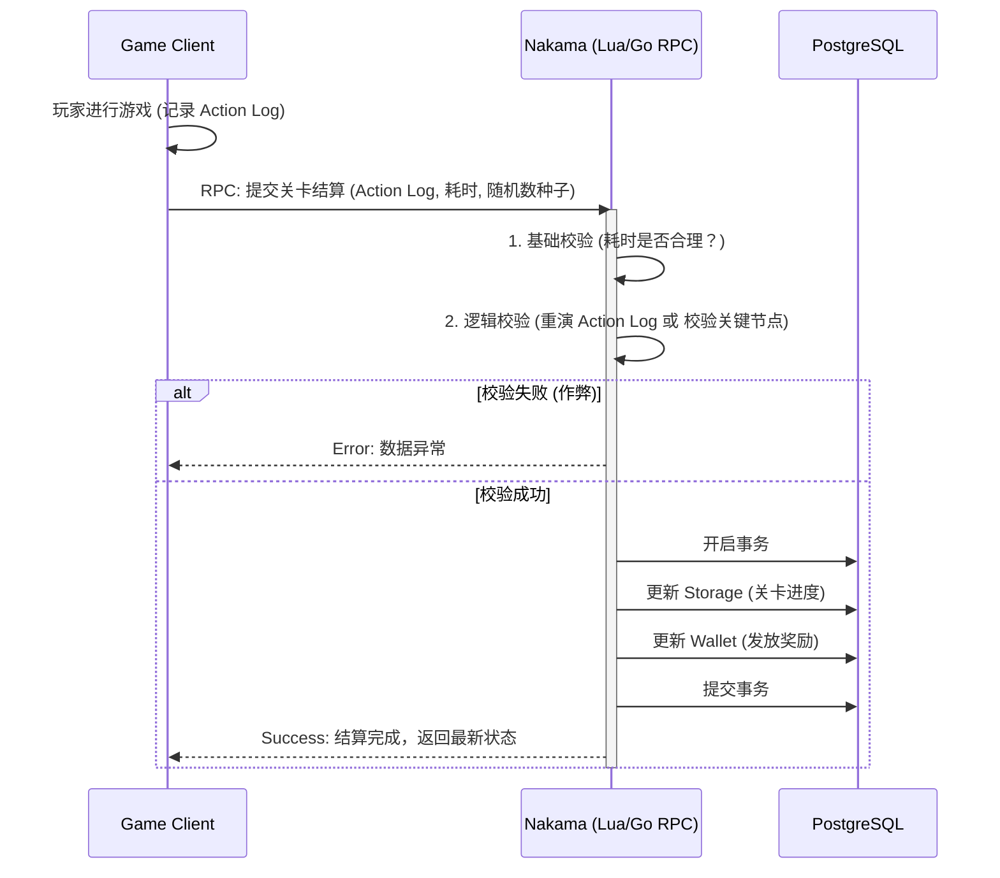

# Nakama 生产环境：玩家存档安全与防作弊专题

> 目标：探讨在弱联网/单机转网游架构下，如何利用 Nakama 的特性保证玩家存档（Save Data）的安全性、一致性，并有效防止常见的客户端作弊手段。

---

## 1. 核心痛点：防丢档机制 (Anti-Data Loss)

在弱联网游戏中，“丢档”是玩家最痛恨的体验，也是引发客诉和退款的头号原因。丢档通常发生在：网络闪断导致上传失败、客户端崩溃导致本地存档损坏、多端覆盖错误、或者服务器数据库故障。

### 1.1 客户端本地双备份与离线队列
客户端绝对不能只依赖一份本地存档文件，必须实现以下机制：
1. **双备份 (A/B 存档)**：
   - `save_A.dat` 与 `save_B.dat` 交替写入。每次写入前计算 MD5 校验和。
   - 启动时如果 A 损坏（JSON 解析失败或 MD5 不匹配），自动回退读取 B。
2. **离线操作队列 (Offline Action Queue)**：
   - 玩家在地铁里断网，所有的关键行为（如：通关、抽卡）序列化存入本地 SQLite 或文件队列。
   - 每个 Action 必须带上本地生成的 UUID（`action_id`）。
   - 网络恢复时，按顺序将 Queue 中的 Action 逐个发送给 Nakama RPC。服务器通过 `action_id` 保证幂等性，防止重复扣除体力。

### 1.2 云端历史快照 (Snapshot History)
不要让新的存档直接覆盖旧存档，必须在 Nakama 中保留历史快照。
- **实现方案**：在 Lua RPC 中，每次更新主存档前，将旧存档写入一个专门的快照 Collection。
```lua
-- Lua 伪代码：保存快照
local function save_with_snapshot(context, new_data)
    -- 1. 读取当前老存档
    local old_data = nk.storage_read({{ collection = "saves", key = "main", user_id = context.user_id }})
    
    -- 2. 将老存档写入快照集合，key 使用时间戳
    if old_data[1] then
        nk.storage_write({{
            collection = "saves_history",
            key = tostring(nk.time()),
            user_id = context.user_id,
            value = old_data[1].value
        }})
    end
    
    -- 3. 写入新存档
    nk.storage_write({{ collection = "saves", key = "main", user_id = context.user_id, value = new_data }})
end
```
- **快照清理**：编写一个 Nakama 定时任务（Cron），每天夜间清理超过 7 天的 `saves_history`，防止数据库膨胀。

### 1.3 基于 PostgreSQL 的底层防丢档方案
Nakama 的所有数据最终落盘在 PostgreSQL。必须在数据库层面做好兜底：
1. **开启 WAL (Write-Ahead Logging)**：确保即使数据库进程崩溃，已提交的事务也不会丢失。云托管 PG 默认开启。
2. **PITR (Point-in-Time Recovery) 按时间点恢复**：
   - 必须购买支持 PITR 的云数据库（如阿里云 RDS 的日志备份功能）。
   - 允许将整个数据库回滚到过去 7 天内的**任意一秒**。这是应对“程序员写错脚本导致全服玩家数据被毁”的终极救命稻草。
3. **读写分离与高可用**：生产环境必须使用“一主一备”架构。主库宕机时，云服务能在 30 秒内自动将流量切换到备库，Nakama 会自动重连，玩家几乎无感知。

### 1.4 运维备份与应急预案 (SOP)
当发生大规模丢档或数据污染时，团队必须有明确的 SOP：
- **预案 A：单玩家丢档/覆盖**
  - **操作**：客服通过 Nakama Admin UI 或自建后台，查询该玩家的 `saves_history` Collection。
  - **恢复**：找到玩家确认的正常时间点快照，将其内容覆盖回 `saves` Collection 的 `main` key 中。
- **预案 B：全服数据污染（如发错奖励、脚本 Bug）**
  - **操作**：立即在云控制台停止 Nakama 容器集群（切断玩家连接）。
  - **恢复**：在云数据库控制台，使用 PITR 功能，克隆一个故障发生前 1 分钟的新数据库实例。
  - **上线**：修改 Nakama 的 `.env` 指向新数据库，重启集群。
- **日常巡检**：每周一上午，运维人员必须登录云控制台，检查 PG 的自动备份是否成功生成，并抽查一次备份文件的可恢复性。

---

## 2. 存档安全的核心挑战

在弱联网游戏中，玩家的大部分行为在本地计算，随后将结果（或过程）同步到服务器。这种架构面临三大核心挑战：

1. **内存修改作弊**：玩家使用修改器（如 Cheat Engine、GameGuardian）修改本地内存中的金币、攻击力等数值，然后将脏数据同步给服务器。
2. **抓包与重放攻击**：玩家截获客户端与服务器的通信数据包，修改内容后发送，或者重复发送合法的“领取奖励”数据包。
3. **存档冲突与覆盖**：玩家在多设备登录，或者在弱网环境下发生重连，导致旧存档覆盖了新存档。

---

## 2. Nakama 存档存储策略选型

Nakama 提供了多种存储玩家数据的方式，针对不同的安全级别，应采用不同的策略：

### 2.1 Storage Engine (通用存储)
- **适用场景**：非敏感数据（如玩家设置、UI 布局、已解锁的图鉴）。
- **权限控制**：Nakama Storage 支持读写权限（Read/Write Permission）设置。
  - `Read: 1 (Owner Read)` / `Write: 1 (Owner Write)`：客户端可直接读写。**极度不安全**，仅限非敏感数据。
  - `Read: 1 (Owner Read)` / `Write: 0 (No Write)`：客户端只读，**必须通过服务器端 Lua/Go 脚本写入**。敏感数据（如金币、等级、核心道具）必须使用此权限。

### 2.2 Wallet (钱包系统)
- **适用场景**：虚拟货币（金币、钻石）。
- **优势**：Nakama 的 Wallet 提供了事务性（Transactional）的加减操作，天然防止并发修改导致的数值错误。
- **安全规则**：客户端**绝对不能**直接修改 Wallet，必须通过 RPC 调用服务器脚本，由服务器验证逻辑后修改。

---

## 3. 防作弊与存档校验架构

为了防止客户端上传脏数据，必须坚持 **“服务器是唯一真理（Server is Authoritative）”** 的原则。

### 3.1 状态机与行为日志同步 (Action Log Sync)
不要让客户端直接上传“最终结果”（例如：我通关了，给我 1000 金币），而是上传“行为日志”（例如：我使用了技能 A，击败了怪物 B）。



### 3.2 关键校验点设计
在服务器端的 RPC 脚本中，至少需要实现以下校验：
1. **时间戳校验**：客户端提交的通关时间是否小于理论最短时间？（防加速挂）。
2. **数值上限校验**：单次产出的金币/经验是否超过了该关卡的理论最大值？
3. **前置条件校验**：玩家是否拥有进入该关卡的门票/体力？玩家当前的等级是否允许获得该物品？

---

## 4. 防重放攻击 (Replay Attack)

如果玩家截获了“领取每日签到奖励”的请求并疯狂重发，服务器必须能识别并拒绝。

### 4.1 幂等性设计 (Idempotency)
确保同一个请求执行多次，结果和执行一次是一样的。
- **错误做法**：RPC `AddGold(100)`。
- **正确做法**：RPC `ClaimDailyReward(Day=5)`。服务器检查 Storage 中是否已经记录了 `Day=5` 的领取状态，如果已领取则拒绝。

### 4.2 序列号/版本号机制 (Version Control)
利用 Nakama Storage 的 `version` 字段实现乐观锁（Optimistic Locking）。

1. 客户端读取存档，获取当前 `version`（例如 `v1`）。
2. 客户端发起修改请求，带上 `v1`。
3. 服务器检查数据库中的 `version` 是否仍为 `v1`。
   - 如果是，执行修改，`version` 更新为 `v2`。
   - 如果不是（说明已经被其他请求修改过，或者是重放攻击），拒绝请求。

---

## 6. 存档冲突与多端同步

玩家在手机 A 玩了一会儿（离线），又在手机 B 玩了一会儿（在线），手机 A 恢复网络后如何处理？

### 6.1 冲突解决策略
1. **服务器时间戳优先**：以服务器最后接收到的存档为准（最简单，但可能丢失玩家离线进度）。
2. **客户端提示合并**：当服务器检测到 `version` 冲突时，拒绝写入，并将服务器最新存档下发给客户端。客户端弹出 UI：“检测到云端有更新的存档，是否覆盖本地？”
3. **增量合并 (CRDT/Event Sourcing)**：最复杂但也最完美。客户端不上传全量存档，只上传增量操作（如“获得了剑A”），服务器将增量操作合并到主存档中。

### 6.2 Nakama 乐观锁实现示例 (Lua)

```lua
local nk = require("nakama")

local function update_save_data(context, payload)
    local data = nk.json_decode(payload)
    local new_state = data.state
    local expected_version = data.version -- 客户端认为的当前版本

    local write_request = {
        collection = "saves",
        key = "player_state",
        user_id = context.user_id,
        value = new_state,
        version = expected_version -- 开启乐观锁
    }

    local status, err = pcall(nk.storage_write, { write_request })
    if not status then
        -- 如果 version 不匹配，storage_write 会抛出错误
        return nk.json_encode({ success = false, error = "Version conflict or outdated save" })
    end

    return nk.json_encode({ success = true })
end

nk.register_rpc(update_save_data, "rpc_update_save_data")
```

---

## 7. 总结与最佳实践清单

1. **防丢档第一**：落实客户端 A/B 备份、云端快照、PGSQL PITR 恢复三级防护。
2. **敏感数据零信任**：金币、钻石、核心道具的 `Write` 权限必须设为 `0`，只能通过服务器 RPC 修改。
3. **使用 Wallet 管理货币**：利用 Nakama 内置的 Wallet 系统处理货币的增减，避免并发问题。
4. **校验行为而非结果**：客户端上传战斗过程或关键指标，服务器进行合理性校验后再发放奖励。
5. **开启乐观锁**：利用 Storage 的 `version` 字段防止重放攻击和多端覆盖。
6. **通信加密**：生产环境必须强制使用 WSS/HTTPS，防止中间人明文抓包。
