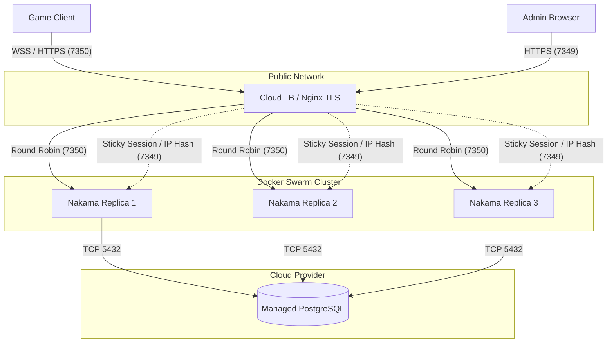

# Nakama on Ubuntu：Docker Swarm 部署与生产最佳实践（10K CCU 版）

> 状态：V2（云 PG + Swarm 编排）  
> 目标：在 Ubuntu 服务器上，以 Docker Swarm 方式部署 Nakama 集群，对接云托管 PostgreSQL，满足 3人团队、约 10K CCU 的生产可用性。

---

## 1. 架构选型与 10K CCU 推荐

针对 **3 人小团队 + 10K 同时在线** 的场景，核心诉求是高可用、低心智负担、易维护。

- **容器编排：Docker Swarm**
  - **为什么不用 K8s**：K8s 运维复杂度高（网络、证书、监控、调度），容易导致平台维护成本 > 业务收益。
  - **为什么用 Swarm**：与 Docker Compose 语法高度兼容，支持多节点、多副本、滚动更新与服务发现，足够支撑 10K CCU，且几乎没有额外学习成本。
- **数据库：云托管 PostgreSQL**
  - 数据库是状态核心，自建 PG 的高可用（Patroni/Repmgr）和灾备极其复杂。直接购买云服务（如阿里云 RDS、AWS RDS）是最明智的投资。
- **资源预估（起步建议）**：
  - **Nakama 节点**：3 个副本（单副本建议 2 vCPU / 4~8 GB RAM）。
  - **PostgreSQL**：选择支持高并发连接的规格（建议 4核 8G 起步），并开启连接池。

---

## 2. 生产拓扑图



> **关于 Admin UI 的路由说明**：
> Nakama 的 Admin Console (7349) 是有状态的（基于 Cookie/Session）。如果通过 LB 轮询访问多个 Nakama 节点，会导致登录状态丢失或频繁被踢出。
> **解决方案**：在 Nginx 或云 LB 上，针对 `7349` 端口必须配置 **会话保持（Sticky Session）** 或 **IP Hash** 负载均衡策略，确保同一个管理员的请求始终落到同一个 Nakama 节点上。客户端 API (7350) 是无状态的（基于 JWT），可以安全地使用轮询（Round Robin）。

---

## 3. 目录结构建议

```text
/opt/nakama/
   stack.yml               # Swarm 编排文件
   .env                    # 环境变量（不入库）
   modules/                # Lua runtime modules
```

---

## 4. 数据库迁移 (Migrate)

在使用 Swarm 启动集群前，**必须先对云 PG 执行一次 Migrate**。
由于 Swarm 会自动重启退出的容器，Migrate 这种一次性任务建议直接用 `docker run` 手动执行：

```bash
# 替换为你的云 PG 真实地址和密码
docker run --rm -it heroiclabs/nakama:3.22.0 migrate up \
  --database.address "postgres:YOUR_DB_PASS@YOUR_CLOUD_PG_HOST:5432/nakama?sslmode=disable"
```

---

## 5. Docker Swarm Stack 配置

> 文件：`stack.yml`

```yaml
version: "3.9"

services:
  nakama:
    image: heroiclabs/nakama:3.22.0
    environment:
      - NAKAMA_SERVER_KEY=${NAKAMA_SERVER_KEY}
      - NAKAMA_CONSOLE_USERNAME=${NAKAMA_CONSOLE_USERNAME}
      - NAKAMA_CONSOLE_PASSWORD=${NAKAMA_CONSOLE_PASSWORD}
      - DB_ADDRESS=postgres:${POSTGRES_PASSWORD}@${POSTGRES_HOST}:5432/nakama?sslmode=disable
    entrypoint:
      - "/nakama/nakama"
      - "--name"
      - "nakama-node"
      - "--database.address"
      - "$$DB_ADDRESS"
      - "--runtime.path"
      - "/nakama/data/modules"
      - "--socket.server_key"
      - "$$NAKAMA_SERVER_KEY"
      - "--console.username"
      - "$$NAKAMA_CONSOLE_USERNAME"
      - "--console.password"
      - "$$NAKAMA_CONSOLE_PASSWORD"
      - "--logger.level"
      - "INFO"
    volumes:
      - /opt/nakama/modules:/nakama/data/modules:ro
    ports:
      - target: 7350
        published: 7350
        protocol: tcp
        mode: ingress
      - target: 7349
        published: 7349
        protocol: tcp
        mode: ingress
    deploy:
      replicas: 3
      update_config:
        parallelism: 1
        delay: 10s
        order: start-first
      restart_policy:
        condition: any
```

---

## 6. 环境变量

> 文件：`.env`

```dotenv
# 云 PG 配置
POSTGRES_HOST=rm-xxxxxx.pg.rds.aliyuncs.com
POSTGRES_PASSWORD=your_cloud_pg_password

# Nakama 安全配置
NAKAMA_SERVER_KEY=change_me_to_long_random_server_key
NAKAMA_CONSOLE_USERNAME=admin
NAKAMA_CONSOLE_PASSWORD=change_me_to_strong_password
```

---

## 7. Ubuntu 部署步骤

### 7.1 初始化 Swarm 集群

```bash
sudo apt update
sudo apt install -y docker.io
sudo systemctl enable --now docker

# 初始化 Swarm（单节点起步，后续可加 worker 节点）
sudo docker swarm init
```

### 7.2 准备目录与文件

```bash
sudo mkdir -p /opt/nakama/modules
cd /opt/nakama
# 放置 stack.yml 与 .env，并将 Lua 代码放入 modules 目录
```

### 7.3 部署 Stack

```bash
# 加载环境变量并部署
export $(cat .env | xargs)
sudo -E docker stack deploy -c stack.yml nakama-cluster
```

### 7.4 查看状态与日志

```bash
# 查看服务与副本数
sudo docker service ls
sudo docker service ps nakama-cluster_nakama

# 查看日志
sudo docker service logs -f nakama-cluster_nakama
```

---

## 8. 运维与安全最佳实践

### 8.1 模块更新与平滑重启
当 `modules/` 下的 Lua 代码更新后，需要重启 Nakama 容器。Swarm 支持滚动更新，不会中断服务：
```bash
sudo docker service update --force nakama-cluster_nakama
```

### 8.2 安全加固与负载均衡配置
1. **控制台隔离**：`7349` 端口不要直接对公网开放，建议在云防火墙/安全组中限制仅公司 IP 可访问。
2. **Admin UI 会话保持**：在 Nginx 或云 LB 上，针对 `7349` 端口必须配置 **IP Hash** 或 **Sticky Session**，否则管理员登录后会因请求落到不同节点而频繁掉线。
3. **TLS 卸载**：在 Nakama 前方必须挂载 Nginx 或云负载均衡（LB），配置 SSL 证书，客户端通过 `wss://` 和 `https://` 连接。
4. **数据库白名单**：云 PG 的白名单仅放行 Swarm 节点的公网/内网 IP。

### 8.3 监控与备份
- **数据库备份**：直接依赖云 PG 的自动备份策略（建议开启按时间点恢复 PITR）。
- **监控**：利用云厂商的 RDS 监控面板关注 CPU、IOPS 和连接数；Nakama 层面后续可接入 Prometheus 抓取 `/metrics`。

---

## 9. 成本预估与公测过渡方案

针对 3 人团队，成本控制至关重要。以下基于国内主流云厂商（如阿里云/腾讯云）的包年包月+按量计费模式进行预估。

### 9.2 阶段化演进与成本预估表格

为了避免前期资源浪费，建议采用以下三个阶段的平滑过渡方案。得益于 Docker Swarm 和云数据库的弹性，各阶段之间的升级几乎是无缝的。

#### 阶段一：内测/公测起步期（0 ~ 3K CCU）
**目标**：跑通核心流程，验证商业化，极致压缩成本。

| 资源类型 | 规格建议 | 数量 | 预估年成本 (RMB) | 备注说明 |
| :--- | :--- | :--- | :--- | :--- |
| **Nakama 节点** | 2核 4G | 1 台 | 约 ¥1,200 | 单节点运行，`stack.yml` 中 `replicas: 1`。 |
| **云数据库** | 2核 4G (高可用版) | 1 个 | 约 ¥6,000 | 满足初期数据读写，必须带主备。 |
| **负载均衡** | 标准型实例 | 1 个 | 约 ¥1,000 | 预留 LB，方便后续无缝加节点。 |
| **公网流量费** | 按量计费 | - | 约 ¥3,000 | 玩家少，流量极低。 |
| **阶段一总计** | | | **约 ¥11,200 / 年** | **折合每月约 ¥930** |

#### 阶段二：增长期（3K ~ 6K CCU）
**目标**：提升可用性，消除单点故障，支撑买量带来的玩家涌入。

| 资源类型 | 规格建议 | 数量 | 预估年成本 (RMB) | 备注说明 |
| :--- | :--- | :--- | :--- | :--- |
| **Nakama 节点** | 2核 4G | 2 台 | 约 ¥2,400 | 新增1台加入 Swarm，`replicas: 2`。 |
| **云数据库** | 2核 4G (高可用版) | 1 个 | 约 ¥6,000 | 暂不升级，观察 CPU 和 IOPS 瓶颈。 |
| **负载均衡** | 标准型实例 | 1 个 | 约 ¥1,000 | 流量分发到 2 个节点。 |
| **公网流量费** | 按量计费 | - | 约 ¥8,000 | 流量随玩家数线性增长。 |
| **阶段二总计** | | | **约 ¥17,400 / 年** | **折合每月约 ¥1,450** |

#### 阶段三：全量爆发期（6K ~ 10K+ CCU）
**目标**：高并发、高可用，完全释放性能。

| 资源类型 | 规格建议 | 数量 | 预估年成本 (RMB) | 备注说明 |
| :--- | :--- | :--- | :--- | :--- |
| **Nakama 节点** | 2核 4G | 3 台 | 约 ¥3,600 | 达到 3 节点集群，`replicas: 3`。 |
| **云数据库** | 4核 8G (高可用版) | 1 个 | 约 ¥11,500 | 云控制台一键升级规格（会有秒级闪断）。 |
| **负载均衡** | 标准型实例 | 1 个 | 约 ¥1,000 | 流量分发到 3 个节点。 |
| **公网流量费** | 按量计费 | - | 约 ¥15,000 | 假设已开启 Protobuf+Gzip 压缩。 |
| **阶段三总计** | | | **约 ¥31,100 / 年** | **折合每月约 ¥2,590** |

> **💡 扩容操作指南**：
> 1. **加节点**：在新机器上执行 `docker swarm join` 加入集群。
> 2. **改副本**：修改 `stack.yml` 中的 `replicas` 数量。
> 3. **热更新**：执行 `docker stack deploy -c stack.yml nakama-cluster`，Swarm 会自动将新容器调度到新节点，业务零中断。
